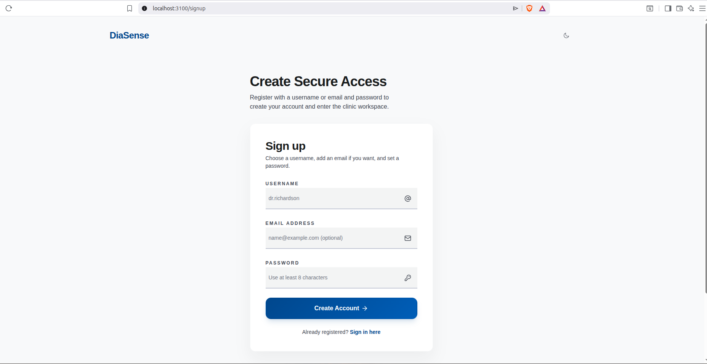
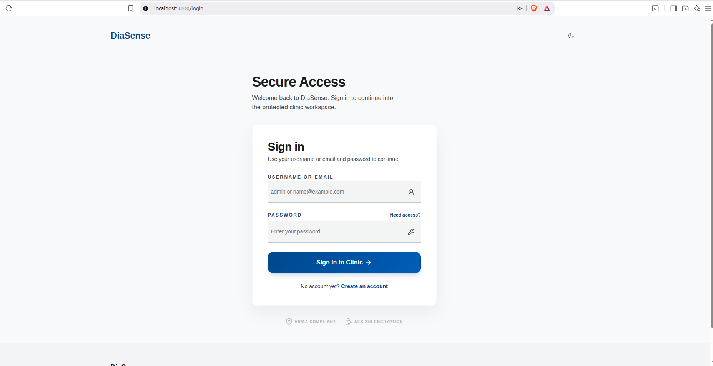
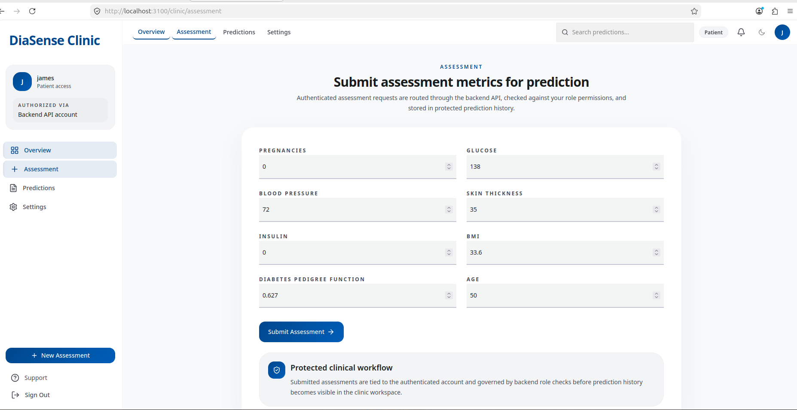
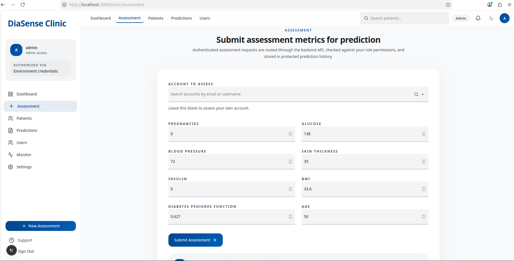
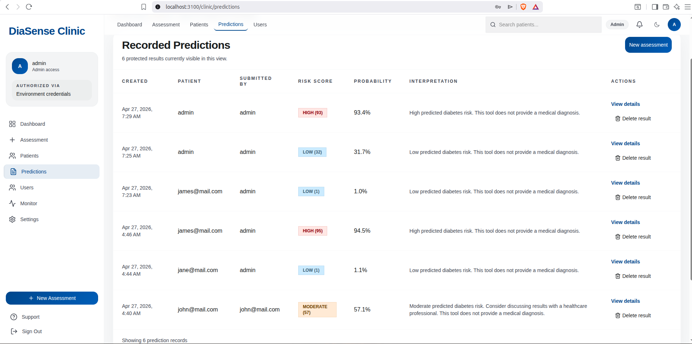
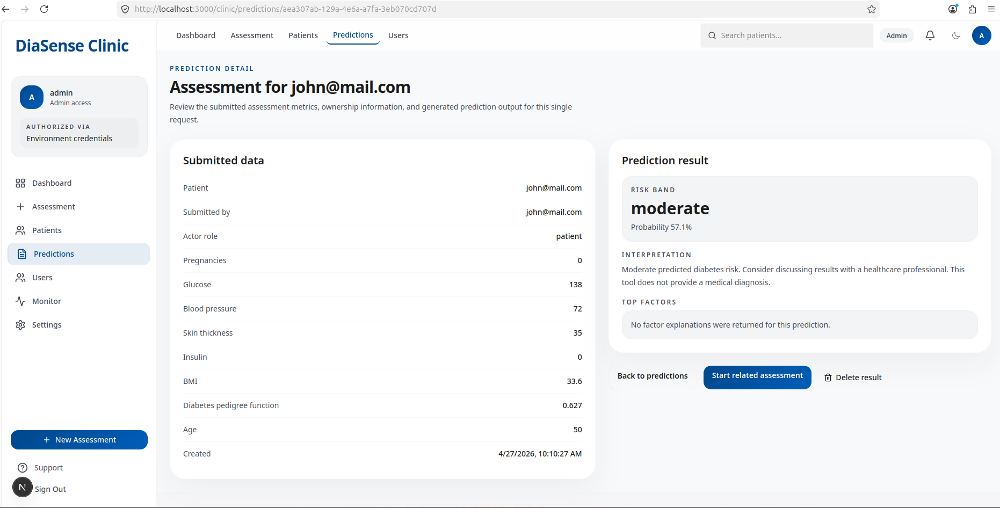
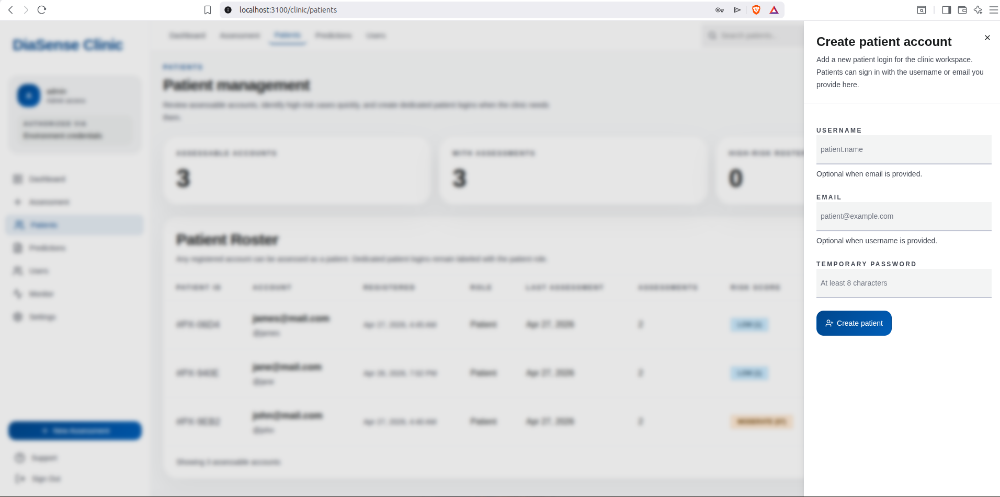
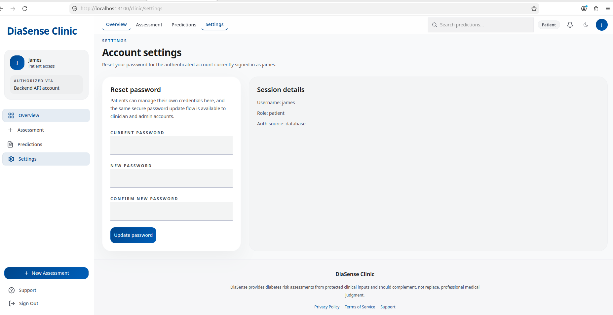
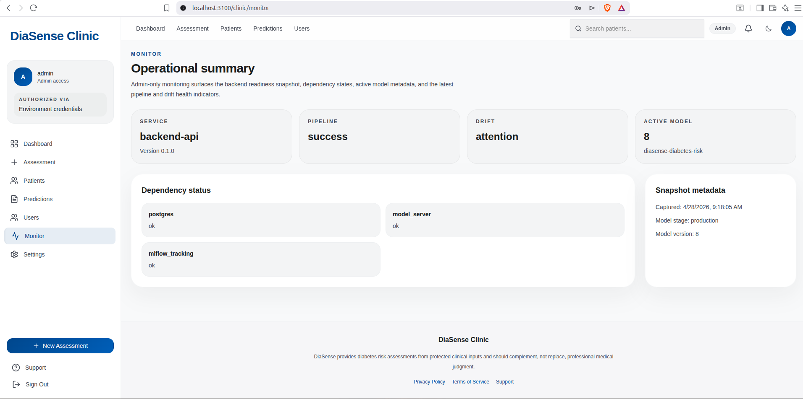

# User Manual

This guide is written for clinic users and non-technical reviewers.

## What DiaSense Does

DiaSense lets you:

- create an account or sign in
- enter diabetes-related assessment values
- receive a risk score and explanation
- review past prediction results
- reset your password

If you are a clinician or admin, you can also:

- assess another patient account
- create patient accounts
- review patient history

## Important Medical Disclaimer

DiaSense does **not** provide a diagnosis.

It is a screening and decision-support tool that estimates diabetes risk from the values entered. Always use a licensed healthcare professional for diagnosis and treatment decisions.

## 1. How To Sign Up

1. Open the DiaSense frontend in your browser.
2. Select `Create an account` or open the signup page.
3. Enter:
   - a username, or
   - an email address, or
   - both
4. Enter a password with at least 8 characters.
5. Select `Create Account`.

What happens next:

- your account is created as a patient account by default
- you are signed in automatically after successful signup

## 2. How To Log In

1. Open the login page.
2. Enter your username or email.
3. Enter your password.
4. Select `Sign In to Clinic`.

If your clinic gave you the default admin access, use the admin credentials configured for the deployment.

## 3. How To Enter Assessment Values

Open `Assessment` from the clinic menu.

Enter these values:

- Pregnancies
- Glucose
- Blood Pressure
- Skin Thickness
- Insulin
- BMI
- Diabetes Pedigree Function
- Age

Tips:

- use numbers only
- double-check decimal points where needed
- clinicians and admins can choose a patient account before submitting
- patients should leave the patient selector empty and submit for themselves

Accepted value ranges in the current system:

- Pregnancies: `0` to `30`
- Glucose: `0` to `300`
- Blood Pressure: `0` to `200`
- Skin Thickness: `0` to `100`
- Insulin: `0` to `1000`
- BMI: `0` to `100`
- Diabetes Pedigree Function: `0` to `10`
- Age: `1` to `120`

### Patient self Assessment

### clinician and admin Assessment

## 4. How To Submit An Assessment

1. Enter the values.
2. Select `Submit Assessment`.
3. Wait for the result card to appear.

After a successful submission, the screen shows:

- risk band
- probability percentage
- interpretation text
- patient account used
- submitter identity
- latency
- top contributing factors, if available

## 5. How To Interpret The Result

DiaSense groups the prediction into one of three risk bands:

- `Low`: probability below `0.33`
- `Moderate`: probability from `0.33` up to but not including `0.66`
- `High`: probability `0.66` or higher

What the result means:

- `Low` means the model saw a relatively lower predicted risk from the provided values
- `Moderate` means the model saw a meaningful risk signal and the result should be reviewed carefully
- `High` means the model saw a strong risk signal and follow-up is strongly recommended

Again, this is **not a diagnosis**.

## 6. How To View Prediction History

1. Open `Predictions` from the clinic menu.
2. Review the list of saved assessments.

The page shows:

- creation time
- patient account
- submitter
- risk band
- probability
- interpretation

Patients will normally see only their own history.

Clinicians and admins can view broader clinic history and filter by patient.

## 7. How To View Prediction Details

1. Open the `Predictions` page.
2. Select `View details` for any record.

The detail page shows:

- all submitted assessment values
- patient and submitter information
- the calculated risk band
- probability
- interpretation
- top factors, when available

## 8. How To Add New Patients

This option is available to clinicians and admins.

1. Open `Patients`.
2. Select `Add patient`.
3. Enter:
   - username, or
   - email, or
   - both
4. Enter a temporary password.
5. Select `Create patient`.

The new patient can then sign in with the provided username/email and password.

## 9. How To Reset Your Password

1. Open `Settings`.
2. Enter your current password.
3. Enter a new password.
4. Enter the same new password again in the confirmation field.
5. Select `Update password`.

If the update succeeds, a confirmation message appears.

## 10. What To Do If Something Goes Wrong

If you see an error:

- retry the action once
- make sure all required fields are filled
- check that numeric values are within the expected ranges
- if the page says the backend is unavailable, contact the technical operator
- if you cannot sign in, ask the admin to confirm your account exists and your role is correct

## 11. Role Summary

### Patient

- run self-assessments
- view own predictions
- reset own password

### Clinician

- all patient capabilities
- assess patient accounts
- create and remove patient accounts
- view patient prediction history

### Admin

- all clinician capabilities
- manage user roles
- open the monitor page
- inspect operational status

